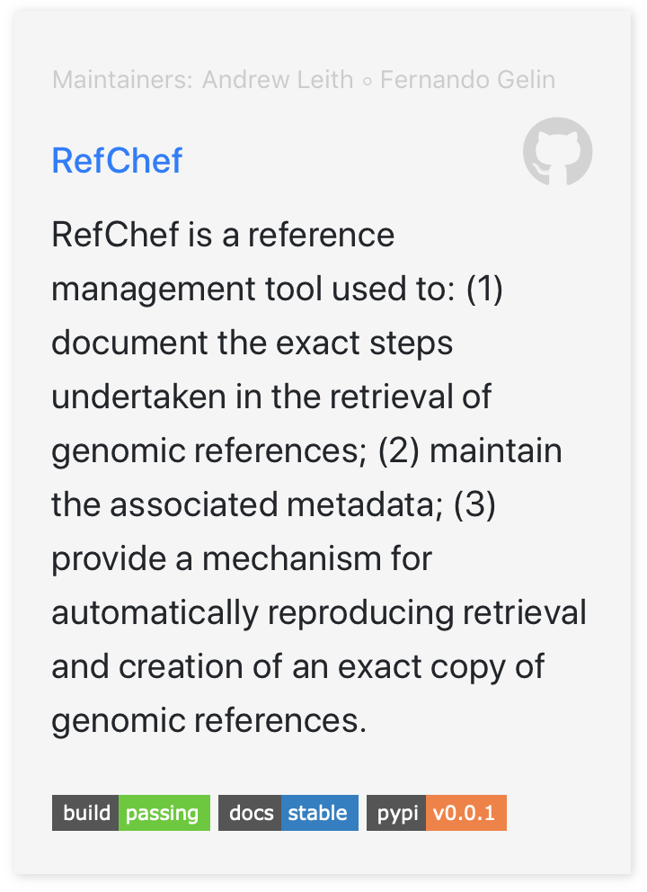

## Setting up your repo for the index website

The index website [https://compbiocore.github.io](https://compbiocore.github.io) is continuously deployed by Travis CI. In order to have a tile on the website with your project's info, create a YAML file called `ready.yml` in the root of your project:

```yaml
repo:             refchef
site_name:        RefChef
authors:      
  - name: Andrew Leith
    github_user: andrew-leith
  - name: Fernando Gelin
    github_user: fernandogelin
repo_url:         https://github.com/compbiocore/bioflows # not required if repo is part of compbiocore organization.
site_description: Short description of project, workshop, tutorial, or document.
docs_url:         https://compbiocore.github.io/bioflows
doi: "10.1007/978-3-319-76207-4_15" # if the project has a related publication.
type: software    # required. choose one of [software, tutorial, workshop, documentation]
pypi: true # if project is on pypi
```

Example of card generated from the `yaml` above:


