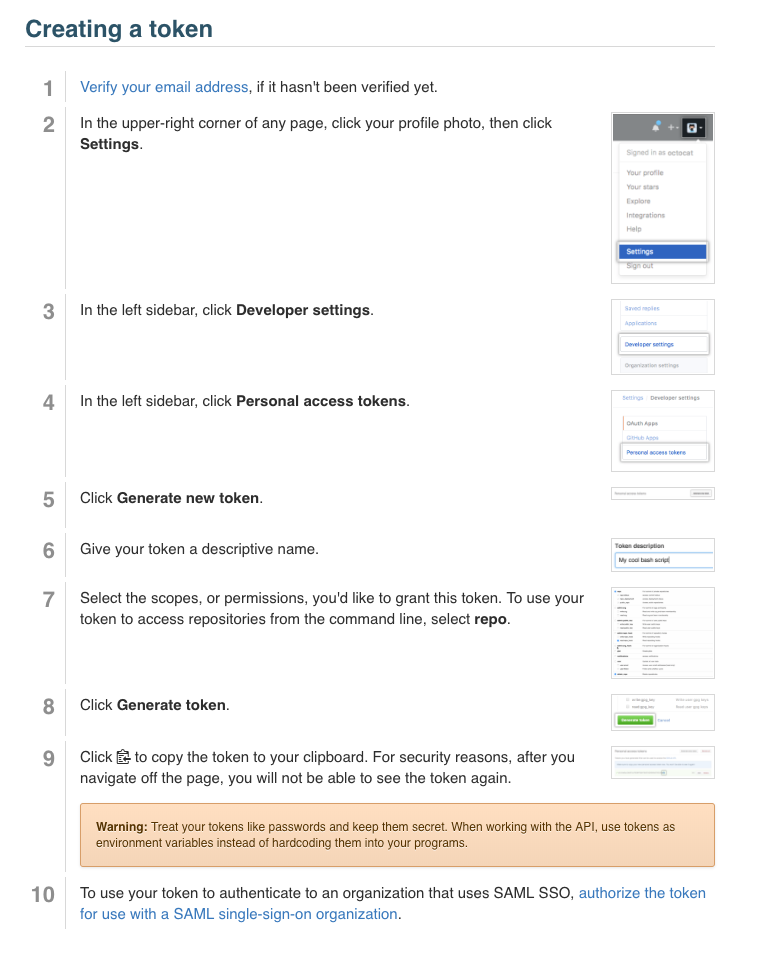
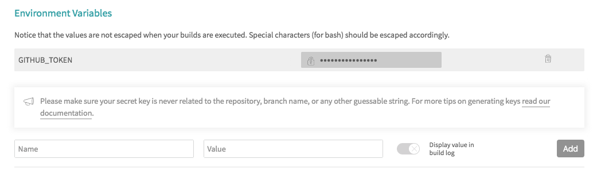
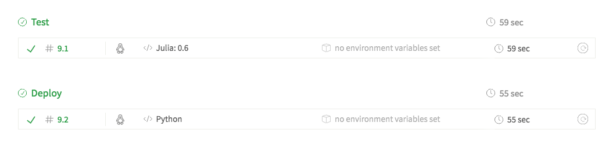

We use [MkDocs](https://www.mkdocs.org/) with [Material design](https://squidfunk.github.io/mkdocs-material/). MkDocs is a powerful static site
generator. The user only needs to provide Markdown files and a `.yml` configuration file
to get started. The Material theme provides a modern, responsive, and intuitive interface to complex documentation.

## Installation
!!! note
    Note that you will need to do this only if you want to build your site locally to preview your docs. You won't be deploying it from your local machine. We use continuous deployment with Travis CI to build and deploy the documentation to GitHub Pages, see *Deployment* section.

To install MkDocs and MkDocs-Material:
```
pip install mkdocs mkdocs-material
```

Create your document files and `mkdocs.yml` configuration file (see below), and:
```
mkdocs build
mkdocs serve
```

Navigate to `http://127.0.0.1:8000/` to preview your docs.

## Documentation Structure

The documentation should go in the `docs/` folder in the root of your GitHub project. Assets like
images or with other formats should go in `docs/assests`. The document files should be Markdown.

The organization of the pages in the static site is set in the configuration file `mkdocs.yml`, this file also goes in the root of the project.

```yaml
site_name:        Brown's Computational Biology Core
site_author:      Fernando Gelin
repo_url:         https://github.com/compbiocore/cbc-documentation-templates
site_description: Documentation templates and best-practices for Brown's Computational Biology Core.
site_url:         https://compbiocore.github.io/cbc-documentation-templates/

theme:
  name: material

markdown_extensions:
  - extra
  - tables
  - fenced_code
  - codehilite
  - admonition
  - footnotes

docs_dir: docs/

pages:
  - Home: 'index.md'
  - GitHub: 'readme.md'
  - Documentation: 'mkdocs.md'
```

!!! tip
    Go to [Markdows Extensions for Material](https://squidfunk.github.io/mkdocs-material/extensions/admonition/) to see detailed information on how to use some of the extensions
    listed in `markdown_extensions` above.
    
## Deployment

Documentation is deployed continuously with [Travis CI](https://travis-ci.org/), so you don't need to install MkDocs,
although you will have to install it locally if you want to preview your documentation before
it's deployed.  
To set up continuous deployment to the project's `gh-pages` branch, you first need to obtain a GitHub token from GitHub:


Then, on your project's Travis settings, set the environment variable GITHUB_TOKEN and <span style="color: red; font-weight: bold;">DO NOT</span> check the box to display value during build.


Edit your `.travis.yml` file to use matrix, so we can separate the test and build stages as well as use multiple languages for each (MkDocs uses Python).  
In the test stage, add all the tests you are normally running. In the deploy stage, add the the documentation build steps:
```yaml
matrix: #allows to set up tests/deploys in different languages/environments.
  include: #includes all stages of build
    - stage: test # groups builds by type, add your tests here
      language: julia
      julia:
        - 0.6

    - stage: deploy # this block builds and deploys the docs, it's in Python.
      language: python
      install:
        - pip install mkdocs
        - pip install mkdocs-material
      script:
        - mkdocs build --verbose --clean --strict
      deploy:
       provider: pages
       skip_cleanup: true
       github_token: $GITHUB_TOKEN
       local_dir: site
       on:
         branch: master
```

Travis will show all stages separately:


Done!   
Your documentation site will be available at `https://compbiocore.github.io/projec-name/`.
